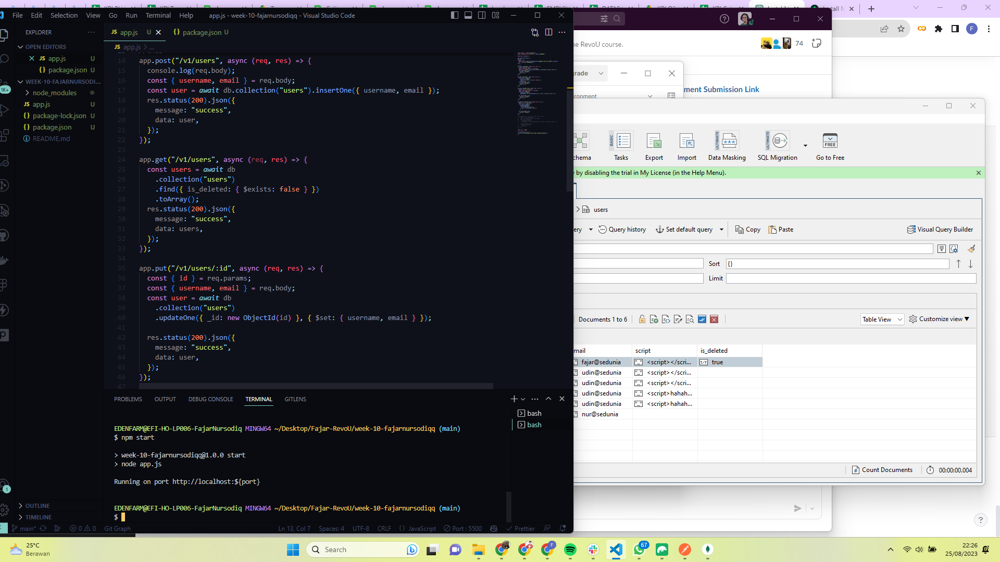
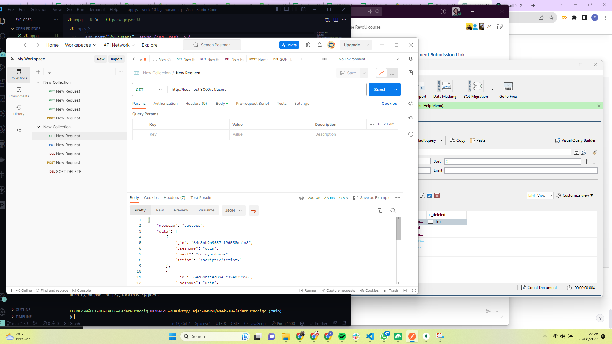
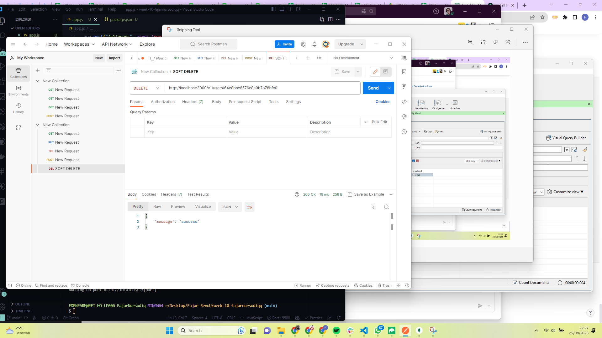
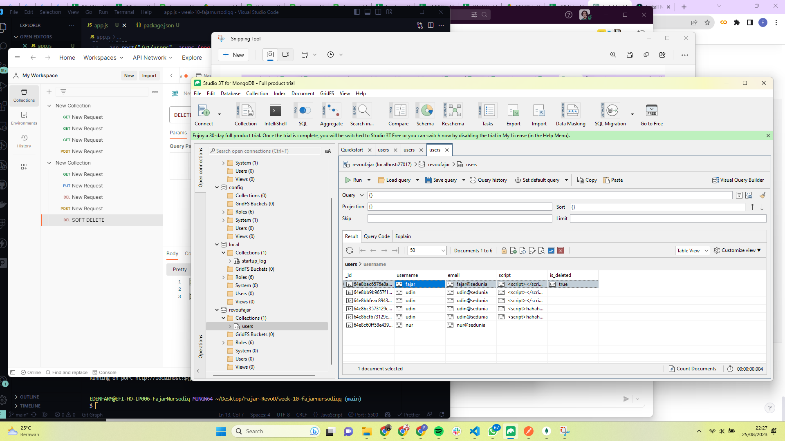
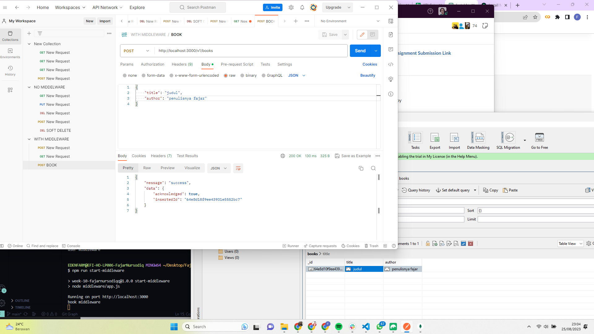

[](https://classroom.github.com/a/zrfmWHEN)

## Tugasnya

- crud in `./app.js`
- middleware in `./middleware`

## Cara Runningnya

crud

```
npm start
```

middleware

```
npm run start-middleware
```






